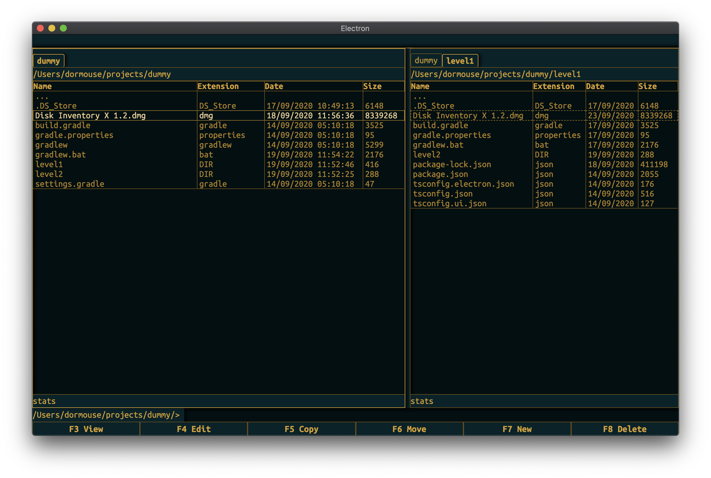
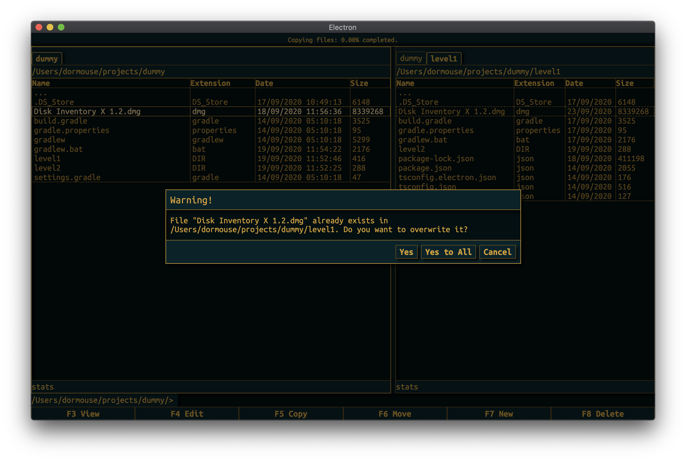

This is a basic 2-panel file manager made mainly for self-educational purposes with Electron and React. 

Project is still very early in development.

If you want to run it:

    npm install
    npm run start

How it looks like:

