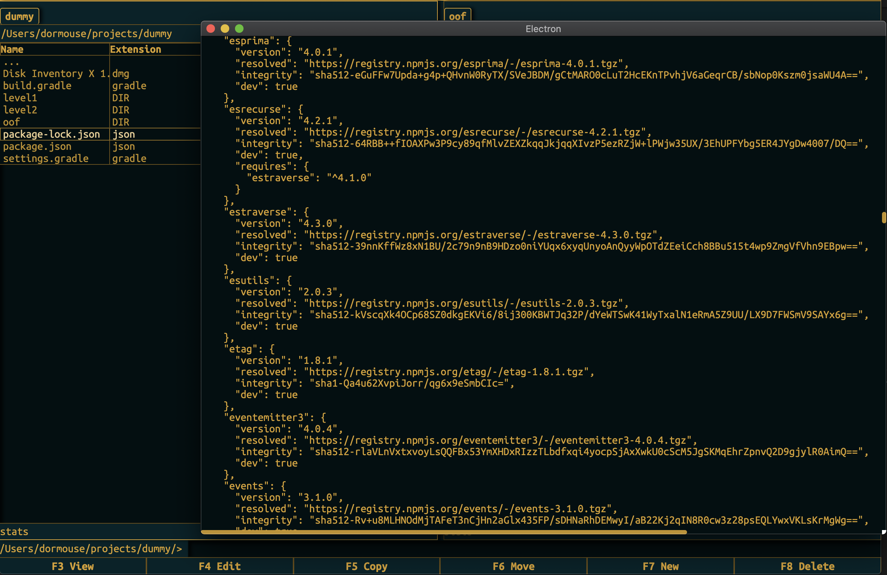

This is a basic 2-panel file manager made mainly for self-educational purposes with Electron and React. 

Project is still very early in development.

If you want to run it:

    npm install
    npm run start

How it looks like:

Main screen - 2 panels for file system navigation and management:

File copy conflict resolution dialog:

Custom file content viewer with lazy load implementation allowing to view large files:

